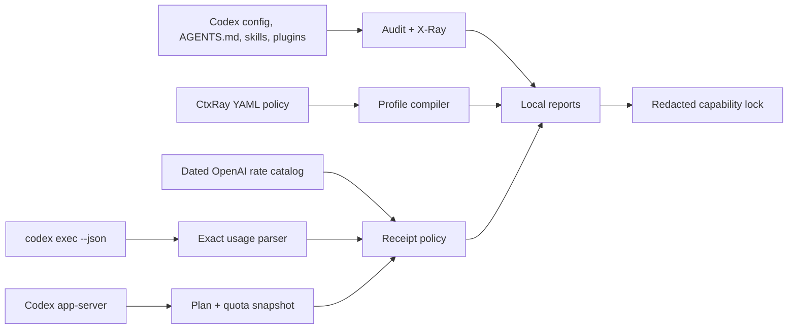

# CtxRay

[](https://www.npmjs.com/package/ctxray)


**Know what enters Codex. Measure what it uses. Change it safely.**

CtxRay is a local-first CLI and Codex plugin for context diagnostics, safe
profile compilation, reproducibility lockfiles, and honest post-turn usage
receipts. It calls no model of its own, requires no API key, and has no
telemetry.

> Community project. Not affiliated with or endorsed by OpenAI.

## Why CtxRay exists

Codex already exposes excellent runtime primitives such as `/status`, `/usage`,
`/statusline`, `codex exec --json`, profile files, and the app-server. The hard
part is connecting them into one answer:

- Which instructions, skills, plugins, agents, and MCP declarations are active?
- Is a large context intentional or accidental?
- Which model/subagent profile should this task use?
- Can another developer reproduce the same capability surface safely?
- Was a dollar amount actually billed, or is it merely an API comparison?

CtxRay does that glue work without becoming another chat wrapper.

## Features

| Command          | What it does                                                                             | Network/model call       |
| ---------------- | ---------------------------------------------------------------------------------------- | ------------------------ |
| `ctxray audit`   | Inventories Codex config layers, guidance, skills, plugins, agents, and MCP declarations | None                     |
| `ctxray map`     | Renders a bounded Mermaid map of context sources and discovery overhead                  | None                     |
| `ctxray xray`    | Summarizes model-visible prompt JSON without echoing its text                            | None                     |
| `ctxray profile` | Compiles YAML into native `~/.codex/<name>.config.toml`, with dry-run and backups        | None                     |
| `ctxray lock`    | Hashes a redacted capability surface for reproducibility                                 | None                     |
| `ctxray quota`   | Reads the current plan and quota window through local Codex app-server                   | Codex account read only  |
| `ctxray receipt` | Calculates a receipt from saved `codex exec --json` usage                                | None                     |
| `ctxray run`     | Runs Codex and appends exact usage plus an optional pre-turn prompt X-Ray                | The requested Codex turn |

## Cost honesty by design

The dollar display is deliberately asymmetric:

| Authentication                       | Default display                             | Dollar meaning                   |
| ------------------------------------ | ------------------------------------------- | -------------------------------- |
| OpenAI API key                       | Exact runtime tokens + dated API estimate   | Estimated billable API charge    |
| ChatGPT Plus/Pro/Business            | Tokens + credit equivalent + quota snapshot | No dollar amount                 |
| Subscription with `--api-equivalent` | Same data + API comparison                  | Comparison only; **not charged** |

CtxRay never calls included subscription usage “money spent”. OpenAI states
that ChatGPT credits have no cash value, so CtxRay does not invent a universal
credit-to-dollar conversion. See [Cost semantics](docs/cost-semantics.md).

## Quick start

Requires Node.js 20 or newer and a working Codex CLI installation.

```shell
npm install --global ctxray
ctxray doctor
ctxray audit
ctxray map --out ctxray-context.mmd
```

If `ctxray doctor` reports that Codex is unavailable, install the official CLI
with `npm install --global @openai/codex`. On Windows, do not rely on directly
executing the private binary inside the packaged desktop app.

GitHub renders the generated Mermaid file locally. Labels contain only the
metadata already returned by `audit`, not prompt text or config values. The
headline is a **known startup estimate**: `AGENTS.md` text and skill discovery
metadata are counted; configuration files are marked as metadata, not falsely
treated as prompt text.

### Add a receipt after a Codex answer

```shell
ctxray run --receipt --prompt-xray --model gpt-5.6-terra "Review the current diff"
```

Example output:

```text
Fake answer...
CtxRay receipt · prompt ≈ 1,003 / 1,050,000 (0.1%) · 10,000 input (8,000 cached) + 500 output · credit equivalent ≈ 0.29 · quota 37% used · rates 2026-08-08
```

For a subscription-only API comparison, opt in explicitly:

```shell
ctxray run --receipt --prompt-xray --api-equivalent --model gpt-5.6-terra "Review the current diff"
```

`--prompt-xray` asks Codex's experimental local debug command to render the
model-visible input before the turn; CtxRay converts its character count into
an explicitly estimated token value. The consumed input/output counters come
separately from `turn.completed` and may aggregate several model calls. The
footer itself is rendered locally after completion and consumes no model
tokens.

### Inspect model-visible prompt structure

Capture the experimental Codex diagnostic, then analyze the saved JSON:

```shell
codex debug prompt-input "Review this repository" > prompt-input.json
ctxray xray prompt-input.json
```

CtxRay reports role counts, characters, and explicitly estimated tokens. It
does not include prompt text in its report.

### Compile native Codex profiles

```shell
ctxray profile examples/ctxray.yaml --dry-run
ctxray profile examples/ctxray.yaml
```

The second command stages files under `.ctxray/profiles`. Installing into
`CODEX_HOME` is a separate, explicit action:

```shell
ctxray profile examples/ctxray.yaml --install
```

Existing profiles are copied to `~/.codex/.ctxray-backups/<timestamp>/` first.

### Create a reproducibility lockfile

```shell
ctxray lock --out ctxray.lock.json
```

The lockfile contains hashes and relative paths, not prompt history. Secret-like
config values and all MCP environment values are redacted before hashing.

## Install the Codex plugin from a checkout

The repository includes a validated marketplace and plugin bundle:

```shell
codex plugin marketplace add .
```

Restart the ChatGPT desktop app, open the Plugins Directory, select the CtxRay
marketplace, and install CtxRay. After the repository is public, the same
marketplace can be added using its GitHub `owner/repository` shorthand.

The bundled `$ctxray` skill has implicit invocation disabled. Its instructions
are loaded only when the user explicitly invokes it.

## Architecture



See [Architecture](docs/architecture.md) and [Privacy and security](docs/privacy-security.md).

## Measurement labels

- **Exact**: returned by the Codex runtime or account surface.
- **Estimated**: derived from a declared character proxy or dated rate card.
- **Unknown**: unavailable. CtxRay never replaces it with zero.

Claims about savings require comparable tasks that pass the same quality gate.
CtxRay does not translate token estimates into a weekly allowance when Codex
does not expose that conversion.

## Current limitations

- A literal inline footer is available through `ctxray run`. Codex does not
  currently document a plugin API that mutates a native desktop assistant
  message after generation, so the desktop plugin uses a separate result.
- `codex debug prompt-input` and app-server are version-sensitive surfaces.
  CtxRay fails closed to `unknown` when data is unavailable.
- `turn.completed.input_tokens` is aggregate consumption, not current context
  occupancy. Without `--prompt-xray`, CtxRay prints `prompt context unknown`
  instead of dividing that aggregate by the model window.
- Runtime MCP tool schemas and built-in tool schemas are not included in the
  static audit estimate; the audit reports that gap explicitly.
- The bundled 2026-08-08 catalog covers GPT-5.6 Sol, Terra, and Luna. Supply a
  reviewed catalog with `--pricing` for other models or newer prices.
- Token-derived dollar estimates exclude unobserved tool-call fees and cache
  write classes.

## Development

```shell
npm ci
npm run check
npm run build
npm run validate:plugin
npm pack --dry-run
```

The test suite includes unit, integration, and process-level CLI tests. Coverage
thresholds are at least 80% for statements, branches, functions, and lines. See
the [v0.1 TDD evidence](docs/testing/v0.1.tdd.md).

Read [CONTRIBUTING.md](CONTRIBUTING.md), [SECURITY.md](SECURITY.md), and the
[roadmap](docs/roadmap.md) before opening a substantial change. Efficiency
claims follow the public [evaluation plan](docs/evaluation-plan.md).

## Official references

- [Codex CLI commands and `prompt-input`](https://learn.chatgpt.com/docs/developer-commands?surface=cli)
- [Codex pricing, credits, and usage limits](https://learn.chatgpt.com/docs/pricing)
- [OpenAI API model prices](https://developers.openai.com/api/docs/models/compare)
- [Codex profile files](https://learn.chatgpt.com/docs/config-file/config-advanced#profiles)
- [Codex app-server protocol](https://github.com/openai/codex/blob/main/codex-rs/app-server/README.md)
- [Codex plugins](https://developers.openai.com/plugins/concepts/plugins)

## License

Apache-2.0. See [LICENSE](LICENSE) and [NOTICE](NOTICE).
